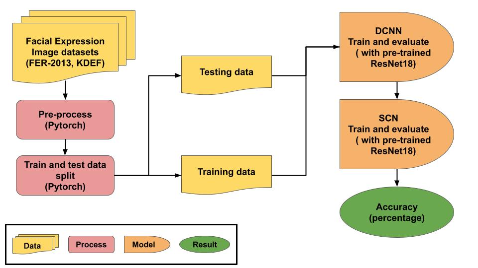

# Capstone
Recent advancements in deep learning, especially the application of Convolutional Neural Networks (CNNs), have guided significant progress in Facial Emotion Recognition (FER). CNNs excel at automatically extracting facial features, leading to the development of robust FER systems. Deep Convolutional Neural Networks (DCNNs) have further elevated FER capabilities, outperforming traditional CNNs. However, DCNNs still face a limitation concerning their demand for high-dimensional datasets. To address this constraint, this paper proposes an ensemble model combining Self-Cure Network (SCN) with DCNN, bolstered by transfer learning.
- [Link to Paper](https://earlham.box.com/s/su3w266tzwnk41u6yfppws3c73ekm8aq)
- [Link to Video](https://youtu.be/lDucrkou2SA)
# Data Architecture Diagram


# Package
Required packages to run the program:
- torch
- numpy
- torchvision
- torch.utils.data
- torch.nn.functional
- torchvision.models
- torch.nn
- torch.nn.functional
- argparse
- random
- matplotlib
- time
- copy
- tensorboardX
- cv2
- python3
- os

# File Information
- 2 original datasets: KDEF and FER2013 are both in `data_1`
- Output images of DCNN that will be used for SCN are in `data_2`
- Main code are in `DCNN`, `SCN`, and `SCN_DCNN`: each folder contain the code and results that are used in the paper.
- `KDEF_preprocess.py`: Preprocessing KDEF into train and test data
# Command lines
First, run the command below to get output from DCNN in folder `DCNN`:
```
  python3 DCNN.py ../data_1/FER2013 ../data_2/FER2013/
```
Then, run both of these command for each dataset in folder `SCN_DCNN`:
```
  python SCN_DCNN_FER.py --margin_1=0.07
  python SCN_DCNN_KDEF.py --margin_1=0.07
```
To run the original SCN:
```
  python SCN_FER.py --margin_1=0.07
  python SCN_KDEF.py --margin_1=0.07
```
